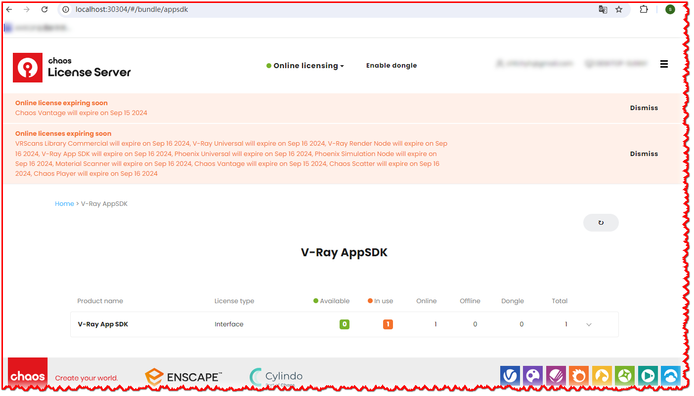

# vray-appsdk-three-editor-integrate
Use vray appsdk as the real-time rendering engine in threejs editor

[English](README.md) | [中文](README.zh-CN.md)

#### Description
This site use vray appsdk to render the scene in threejs editor for the real-time rendering engine

#### Software Architecture
The app is server-client , where express provides and integrates with vray appsdk ; the client side is the extension of THREEJS Editor.

#### Installation

##### Server
1.  Download and install vray appsdk locally (https://www.chaos.com/vray/application-sdk)

2.  Get your trail/product license for vray appsdk , then open (http://localhost:30304) to check if it is ready.



3.  install node v18.x (https://nodejs.org/en/download)

4.  use the soft link in vray appsdk Node 18:
```bash
npm install
mklink /J node_modules\vray "%VRAY_SDK%\node\node_v18\node_modules\vray" 
```

##### Client
1. Download the source code of [three.js](https://github.com/mrdoob/three.js/releases), unzip to local path, like d:\three.js-latest

2. crate a directory soft link
```bash
mklink /J client\three d:\three.js-latest
```

#### Instructions

##### Service

Start the service:
```bash
npm run start
```

open the link in browser: http://localhost:5560/editor


##### Next
1. add the conversion for three mateterial and light

2. optimize the translation from three scene to vray scene

3. add more element translation, like environment, Background
