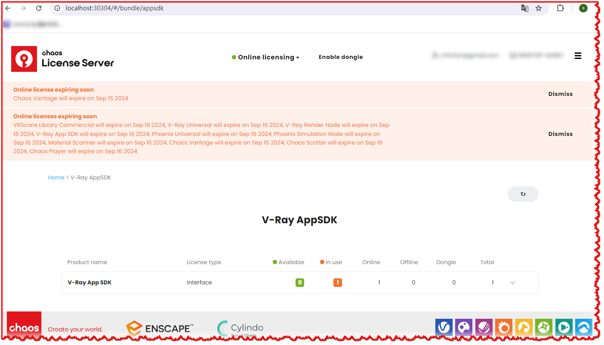

# vray-appsdk-three-editor-integrate
Use vray appsdk as the real-time rendering engine in threejs editor

[English](README.md) | [中文](README.zh-CN.md)

#### 介绍
使用vray appsdk来实现前端threejs editor页面上的场景实时渲染效果

#### 软件架构
本软件为CS架构, server采用Nodejs express服务器, client为THREE Editor的扩展

#### 安装教程

##### Server
1. 在chaos官网上下载, 本地安装 vray app sdk (https://www.chaos.com/vray/application-sdk)
   
2. 在chaos官网上申请vray appsdk license, 打开 http://localhost:30304 检查license安装情况
   


3. 安装并使用node v18.x 版本 (https://nodejs.org/en/download)

4. 使用vray appsdk 中的node 18 版本:
```bash
npm install
mklink /J node_modules\vray "%VRAY_SDK%\node\node_v18\node_modules\vray" 
```

##### Client

1. 下载[three.js](https://github.com/mrdoob/three.js/releases)源代码到本地, 并解压缩, 例如 d:\three.js-latest
   
2. 创建目录链接
```bash
mklink /J client\three d:\three.js-latest
```


#### 使用说明

##### Service

启动服务:
```bash
npm run start
```

在浏览器中打开 http://localhost:5560/editor


##### Next
1. 添加材质和灯光属性的转换

2. 优化从threejs到vrscene的场景生成算法

3. 添加更多场景元素的转换,如environment, Background等

##### Test

test目录下存放了开发过程中一些测试片段和代码, 可供进一步开发和研究使用.